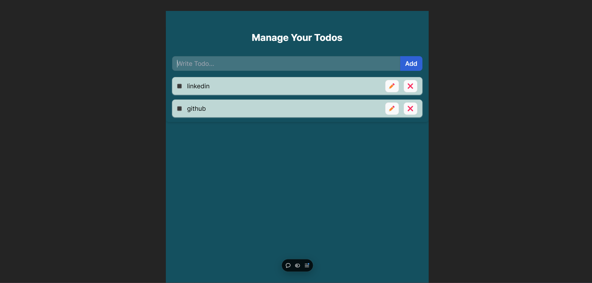

# TodoList

An interactive TodoList made using ReactJS and Tailwind CSS having features like add, edit, delete and mark as complete.It also has localstorage feature.

## Features

- Responsive Design : Looks great on both mobile and desktop devices.
- Add : Has an input field to enter the todo tasks and a button to add the tasks to the list.
- Edit : Has an edit button which allows the users to edit the tasks.
- delete : Has a delete button which deletes the tasks.
- Complete check : Has a check button which toggles completion of tasks.
- localstorage : keeps the tasks even after reloading the page. 

## Demo

Check out the live demo [here](https://todo-list-amber-seven-64.vercel.app/)

## Screenshots




## Installation

1. Clone the repository : 

```bash
  git clone https://github.com/siddhantmishra0/CODTECH_TodoList.git
```

2. Open index.html in your browser.
## Tech Stack

- Tailwind CSS: Used for styling.
- Reactjs: Used for structuring as well as functioning using jsx syntax
- Font Awesome: For incorporating visually appealing icons.

